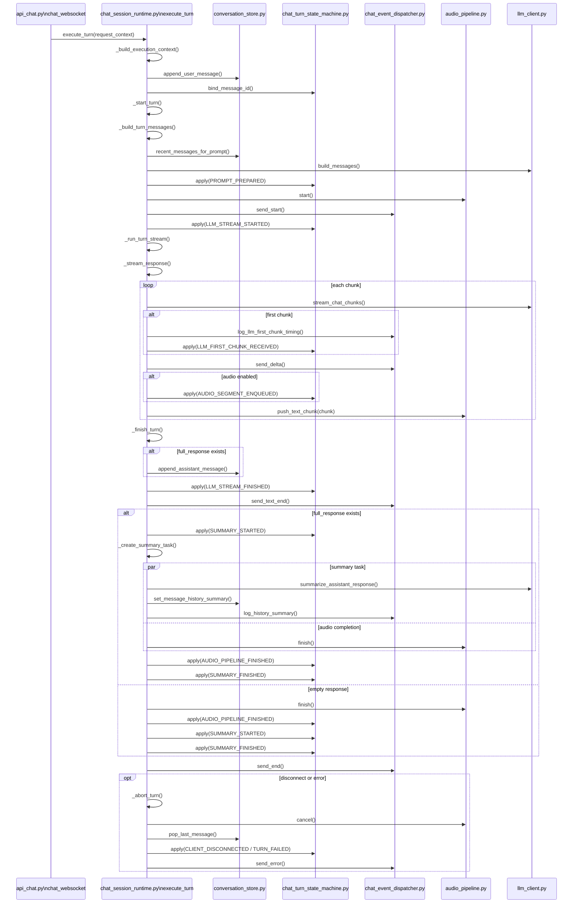

# Chat Flow Diagrams

## Overall Flow

```mermaid
flowchart TD
    A[Client UI\nstatic/app.js\nsendMessage] --> B[WebSocket /ws\napp/api_chat.py\nchat_websocket]
    B --> C[validate_chat_request\napp/api_chat.py]
    C -->|invalid| D[ChatEventDispatcher.send_error\napp/chat_event_dispatcher.py]
    C -->|valid| E[ChatTurnStateMachine.apply\nUSER_MESSAGE_RECEIVED]
    E --> F[ChatTurnStateMachine.apply\nREQUEST_VALIDATED]
    F --> G[ChatSessionRuntime.execute_turn\napp/chat_session_runtime.py]

    G --> H[_build_execution_context]
    H --> H1[get_character\napp/character_registry.py]
    H --> H2[conversation_store.append_user_message\napp/conversation_store.py]
    H --> H3[new_message_id\napp/conversation_store.py]
    H --> H4[AudioPipeline(...)\napp/audio_pipeline.py]

    G --> I[_start_turn]
    I --> I1[_build_turn_messages]
    I1 --> I2[conversation_store.recent_messages_for_prompt]
    I1 --> I3[build_messages\napp/llm_client.py]
    I --> I4[ChatTurnStateMachine.apply\nPROMPT_PREPARED]
    I --> I5[audio_pipeline.start]
    I --> I6[dispatcher.send_start]
    I --> I7[ChatTurnStateMachine.apply\nLLM_STREAM_STARTED]

    G --> J[_run_turn_stream]
    J --> K[_stream_response]
    K --> K1[stream_chat_chunks\napp/llm_client.py]
    K --> K2[log_llm_first_chunk_timing\napp/chat_event_dispatcher.py]
    K --> K3[_handle_first_chunk]
    K3 --> K4[ChatTurnStateMachine.apply\nLLM_FIRST_CHUNK_RECEIVED]
    K --> K5[_handle_stream_chunk]
    K5 --> K6[dispatcher.send_delta]
    K5 --> K7[ChatTurnStateMachine.apply\nAUDIO_SEGMENT_ENQUEUED]
    K5 --> K8[audio_pipeline.push_text_chunk]
    K8 --> K9[stream_segmenter.push_text]
    K8 --> K10[TTSClient.synthesize系呼び出し]
    K8 --> K11[dispatcher.send_audio]

    G --> L[_finish_turn]
    L --> L1[conversation_store.append_assistant_message]
    L --> L2[ChatTurnStateMachine.apply\nLLM_STREAM_FINISHED]
    L --> L3[dispatcher.send_text_end]
    L --> L4[_create_summary_task]
    L4 -->|responseあり| L5[ChatTurnStateMachine.apply\nSUMMARY_STARTED]
    L4 -->|responseあり| L6[_maybe_summarize_turn]
    L6 --> L7[summarize_assistant_response\napp/llm_client.py]
    L6 --> L8[conversation_store.set_message_history_summary]
    L6 --> L9[log_history_summary\napp/chat_event_dispatcher.py]
    L --> L10[audio_pipeline.finish]
    L --> L11[ChatTurnStateMachine.apply\nAUDIO_PIPELINE_FINISHED]
    L --> L12[_complete_summary_state]
    L12 --> L13[ChatTurnStateMachine.apply\nSUMMARY_FINISHED]
    L --> L14[dispatcher.send_end]

    G --> M[except WebSocketDisconnect / Exception]
    M --> N[_abort_turn]
    N --> N1[audio_pipeline.cancel]
    N --> N2[summary_task.cancel]
    N --> N3[_rollback_user_message]
    N3 --> N4[conversation_store.pop_last_message]
    N --> N5[ChatTurnStateMachine.apply\nCLIENT_DISCONNECTED or TURN_FAILED]
    M -->|Exception| N6[dispatcher.send_error]
```

## Runtime Sequence

