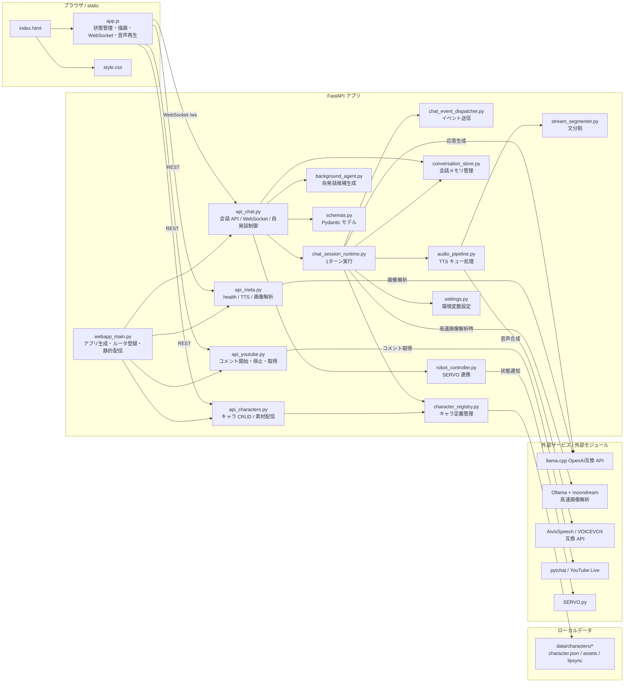
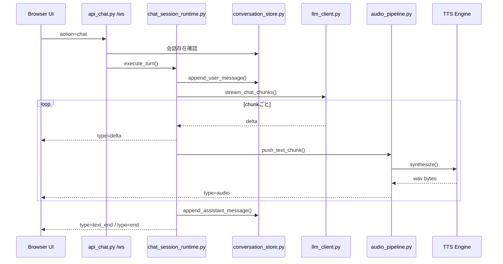
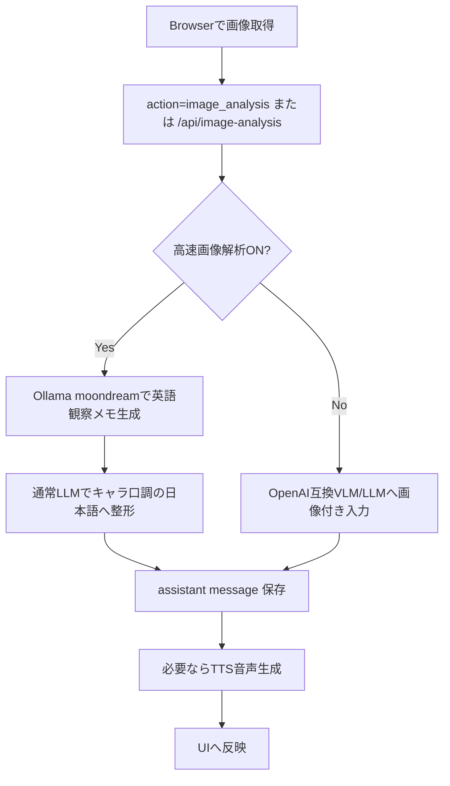

# AItuber Studio 構成図と説明

このドキュメントは、AItuber Studio の全体構成、主要な責務分担、会話処理の流れ、外部サービスとの接続点を俯瞰できるようにまとめたものです。

詳細なチャット内部の状態遷移やシーケンスは、あわせて [chat-flow-diagrams.md](./chat-flow-diagrams.md) を参照してください。

## 1. システム全体図



## 2. レイヤ別の見方

### 2.1 フロントエンド

- `static/index.html`
  - 画面の土台です。
  - 左カラムにキャラクター設定、音声、画像解析、YouTube、Agent 機能をまとめ、右カラムに会話表示と入力欄を持ちます。
- `static/app.js`
  - 実質的なフロントエンド本体です。
  - REST API 呼び出し、`/ws` 接続、ストリーミング描画、TTS 音声再生、マイク録音、画像取得、YouTube コメント投入、waiting lipsync の重ね描画を担当します。
- `static/style.css`
  - レイアウトと見た目を定義します。

フロントエンドはビルド工程を持たないシンプルな静的配信構成で、`webapp_main.py` からそのまま配信されます。

### 2.2 API / エントリポイント

- `webapp_main.py`
  - FastAPI アプリを生成し、API ルータを登録します。
  - `/` で `index.html` を返し、`/static` を静的配信します。
  - 起動時引数で LLM/TTS のホスト・ポート上書きも可能です。
- `app/api_meta.py`
  - ヘルスチェック、TTS メタデータ、単発画像解析 API を提供します。
- `app/api_characters.py`
  - キャラクター定義の作成・更新・削除・一覧取得を提供します。
  - アセット配信と waiting lipsync 用 manifest 配信もここに集約されています。
- `app/api_chat.py`
  - 会話作成、会話取得、履歴クリア、WebSocket 会話処理の入口です。
  - さらに自発話モードの ON/OFF と、background agent の tick 駆動も担当します。
- `app/api_youtube.py`
  - YouTube コメントの取得開始・停止・差分取得 API を提供します。

### 2.3 会話実行レイヤ

会話 1 ターンの中心は `app/chat_session_runtime.py` です。

責務は次の通りです。

1. user メッセージを `conversation_store` に追加
2. キャラクターの system prompt と履歴から LLM 入力を構築
3. LLM ストリームを受け取り、`delta` を即時にフロントへ送信
4. 文区切りごとに `audio_pipeline` へ渡し、必要なら TTS を逐次実行
5. 完成した assistant 応答を保存
6. 長文なら履歴用 summary を非同期生成
7. 失敗時は user 追加分の rollback を実行

この層は、会話そのものの進行を扱う「ホットパス」です。
状態名の管理は `chat_turn_state_machine.py`、イベント送信は `chat_event_dispatcher.py` に分離されており、責務が混ざらないように整理されています。

### 2.4 データ管理レイヤ

- `app/conversation_store.py`
  - 会話とメッセージをメモリ上で保持します。
  - 永続化 DB は使わず、プロセス内メモリを単純な `Lock` つきストアとして扱っています。
  - assistant の長文は `history_summary` へ圧縮し、次回 prompt では summary を使えます。
- `app/character_registry.py`
  - `data/characters/<id>/character.json` を正とするキャラクタレジストリです。
  - キャラ定義の保存、既定キャラ選択、素材ディレクトリ解決、公開用辞書化を担当します。

### 2.5 音声・映像補助レイヤ

- `app/audio_pipeline.py`
  - LLM の文字ストリームを、TTS しやすい短い文へ変換して順次読み上げます。
  - 非同期キューと worker task で、会話本文の streaming を止めずに音声生成を進めます。
- `app/stream_segmenter.py`
  - 句点、感嘆符、改行、必要に応じて読点でも分割します。
- `app/tts_client.py`
  - AivisSpeech / VOICEVOX 互換 API クライアントです。
  - 音声合成だけでなく、エンジン状態やボイス一覧もここから取得します。
- `static/app.js`
  - `audio` イベントをキューイングし、再生完了に応じて UI の `talking` / `waiting` 状態を同期します。
  - waiting lipsync 素材がある場合は、動画と mouth sprite を重ねて疑似口パクを描画します。

### 2.6 補助機能レイヤ

- `app/background_agent.py`
  - 自発話用の観測イベントと proposal を会話ごとに管理します。
  - 現状の主実装は `IdleFollowupProducer` で、一定時間 user 発話が無いと follow-up 候補を提案します。
- `app/robot_controller.py`
  - `chat_turn_state_machine.py` の状態変化を `SERVO.py` へ橋渡しします。
  - サーボ実装が無くても本体処理は止めません。
- `app/youtube_comment_service.py`
  - `pytchat` をバックグラウンドスレッドで動かし、新着コメントを会話ごとのキューに溜めます。
- `app/llm_client.py`
  - 通常会話、履歴要約、画像解析、名前のローマ字化、自発話生成をまとめた LLM 接続レイヤです。

## 3. 主要フロー

### 3.1 通常チャットの流れ



補足:

- user 送信の直後に assistant メッセージ ID を確保し、`start` を先に返します。
- 文字ストリームと音声生成は並列に進みます。
- assistant 応答が長い場合だけ、終了後に履歴圧縮 summary を非同期生成します。

### 3.2 画像解析の流れ



このアプリでは「画像理解そのもの」と「キャラらしい日本語返答」を分離できるため、応答速度重視の経路と単純な画像入力経路を切り替えられます。

### 3.3 自発話の流れ

```mermaid
flowchart TD
    A[user発話 or timer tick] --> B[BackgroundAgentManager.observe]
    B --> C[IdleFollowupProducer]
    C -->|一定時間無発話| D[BackgroundProposal生成]
    D --> E[api_chat.py が proposal を回収]
    E --> F[generate_idle_followup()]
    F --> G[通常assistant応答と同じ形式で送信]
    G --> H[conversation_store へ保存]
```

ポイントは、background agent が直接 UI へ書き込まず、まず proposal を返す構造になっている点です。
これにより、将来的に複数 producer や tool 実行を追加しやすくなっています。

### 3.4 YouTube コメント連携の流れ

```mermaid
flowchart LR
    A[UIで videoId / URL入力] --> B[/api/youtube/start]
    B --> C[youtube_comment_service]
    C --> D[pytchat thread]
    D --> E[新着コメントをsession queueへ格納]
    A --> F[/api/youtube/comments/{conversation_id} を定期poll]
    E --> F
    F --> G[UIが新着コメントを取得]
    G --> H[必要なら既存のuser入力として自動送信]
    H --> I[/ws action=chat]
```

## 4. 主要モジュール責務一覧

| モジュール | 役割 |
| --- | --- |
| `webapp_main.py` | FastAPI 起動入口、静的配信、ルータ登録 |
| `app/api_chat.py` | 会話 API と WebSocket、background follow-up の運転席 |
| `app/chat_session_runtime.py` | 1ターン分の実行制御、rollback、summary |
| `app/chat_turn_state_machine.py` | 会話ターン状態の明示化 |
| `app/chat_event_dispatcher.py` | `start`/`delta`/`audio`/`end`/`error` 送信 |
| `app/audio_pipeline.py` | TTS 逐次生成ワーカー |
| `app/stream_segmenter.py` | テキストを TTS 向け短文に分割 |
| `app/llm_client.py` | LLM / VLM / Ollama 接続共通化 |
| `app/conversation_store.py` | メモリ上の会話履歴管理 |
| `app/character_registry.py` | キャラクター定義と素材の解決 |
| `app/api_characters.py` | キャラ CRUD と lipsync 素材配信 |
| `app/api_meta.py` | health / TTS / 単発画像解析 |
| `app/api_youtube.py` | YouTube コメント API |
| `app/youtube_comment_service.py` | `pytchat` セッション管理 |
| `app/background_agent.py` | 自発話候補の観測と proposal 管理 |
| `app/robot_controller.py` | SERVO モジュールへの状態通知 |
| `static/app.js` | UI 状態管理、通信、再生、入力補助 |

## 5. データの持ち方

### 5.1 会話データ

- 会話は `ConversationStore` のプロセス内メモリに保持されます。
- 1 会話は `conversation_id`、`character_id`、`messages[]` を持ちます。
- assistant メッセージには必要に応じて次の補助フィールドが付きます。
  - `history_summary`
  - `use_summary_for_history`

つまり、現状は再起動で会話履歴が消える設計です。永続化よりも、会話主経路の整理と実験しやすさを優先しています。

### 5.2 キャラクターデータ

キャラ定義はファイルベースです。

```text
data/
  characters/
    <character_id>/
      character.json
      assets/
        main.*
        talking.*
        waiting.*
      mouth_track.json
      mouth/
        closed.png
        half.png
        open.png
```

- `character.json` が設定本体です。
- `assets/` は通常表示・会話表示・待機表示の画像/動画です。
- `mouth_track.json` と `mouth/` は waiting lipsync 用です。

## 6. 外部依存関係

このアプリは、内部だけで完結せず、複数の外部サービスと連携して動きます。

### 必須に近いもの

- OpenAI 互換 API を提供する LLM サーバ
  - 既定では `llama.cpp` 系を想定
  - 用途: 通常会話、要約、自発話、名前ローマ字化、場合によって画像解析

### 任意機能

- Ollama + `moondream`
  - 用途: 高速画像解析
- AivisSpeech Engine / VOICEVOX 互換 API
  - 用途: TTS 音声生成
- `pytchat`
  - 用途: YouTube Live コメント取得
- `SERVO.py`
  - 用途: ロボット・サーボ連携

## 7. 実行時設定

主な設定は `app/settings.py` に集約されています。

代表例:

- `LLM_BASE_URL`, `LLM_MODEL`
- `TTS_URL`, `TTS_SPEAKER_ID`, `TTS_ENABLED`
- `APP_HOST`, `APP_PORT`
- `ASSISTANT_SUMMARY_THRESHOLD_CHARS`, `ASSISTANT_SUMMARY_MAX_CHARS`
- `BACKGROUND_IDLE_FOLLOWUP_SECONDS`, `BACKGROUND_IDLE_FOLLOWUP_COOLDOWN_SECONDS`
- `FAST_IMAGE_ANALYSIS_BASE_URL`, `FAST_IMAGE_ANALYSIS_MODEL`

特徴として、フロントから毎ターン渡す設定と、サーバ既定設定の両方を併用しています。
たとえば履歴要約の閾値は、既定値を `/api/health` で配布しつつ、送信時 payload で上書きできます。

## 8. この構成の設計意図

このアプリの構成は、次の考え方で整理されています。

1. **入口を単純に保つ**
   - `webapp_main.py` はアプリ生成と配信だけに寄せる。
2. **1ターン実行を分離する**
   - 会話のホットパスは `chat_session_runtime.py` に集める。
3. **副作用を別モジュールへ逃がす**
   - WebSocket 送信、TTS、状態通知、YouTube、background agent を分離する。
4. **実験機能を足しやすくする**
   - 高速画像解析、自発話、ロボット連携を主経路と疎結合にしている。
5. **キャラクター差し替えを容易にする**
   - キャラ定義と素材を `data/characters` に寄せ、アプリ本体コードと分離する。

## 9. どこから読むと理解しやすいか

実装を追う順番のおすすめは次の通りです。

1. `webapp_main.py`
2. `app/api_chat.py`
3. `app/chat_session_runtime.py`
4. `app/chat_event_dispatcher.py`
5. `app/audio_pipeline.py`
6. `app/conversation_store.py`
7. `app/llm_client.py`
8. `static/app.js`

そのあとで、必要に応じて以下を追うと全体像を補完できます。

- `app/api_characters.py` / `app/character_registry.py`
- `app/api_youtube.py` / `app/youtube_comment_service.py`
- `app/background_agent.py`
- `app/robot_controller.py`
- [chat-flow-diagrams.md](./chat-flow-diagrams.md)
